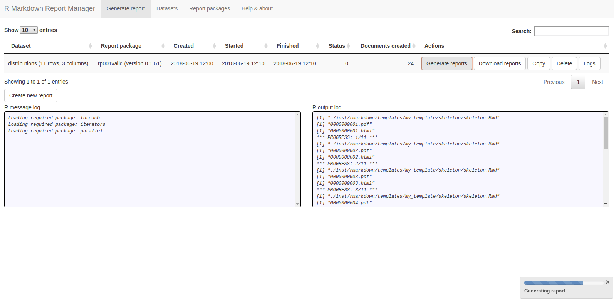
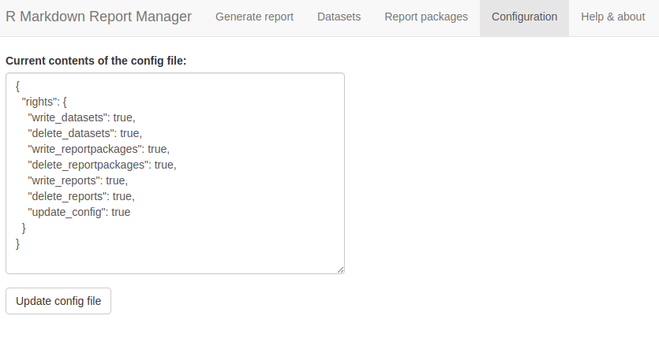

# R Markdown Report Manager (beta)

Generate beautiful, customizable and reproducible Markdown reports. Please note that this app is "beta", but fully functional already. 

Try a simplified live demo here:
[https://www.nilsglueck.io/rmarkdownreportmanager_demo](https://www.nilsole.net/rmarkdownreportmanager_app/index.html)

The live demo is highly restricted. Only report generation and asset downloading are permitted for demo users.



## Implemented features

* Include R tibbles as input datasets (RDS file format expected).
* Use customizable R packages ("report packages") as report templates (Rmarkdown format expected).
* Generate reports: One report file per input dataset row (mapping dataset rows to output files). HTML, PDF and Word supported.

## How to use

The app turns datasets (input) into report documents (output). It does this by converting each line of the input dataset into a document (or several documents). To make the process reproducible, the app keeps track of datasets and templates carefully, helping the user to manage even large numbers of reports.


As of now, input datasets are expected be RDS export files of [tibbles](http://tibble.tidyverse.org/). 

How the report will look like is defined by a "report package", a conventional R package that will render the reports and is usually expected to contain rmarkdown templates. RStudio provides a simple [guide to creating custom R packages](https://support.rstudio.com/hc/en-us/articles/200486488-Developing-Packages-with-RStudio).

The report manager makes it all work as follows: It slices the input dataset into rows and then calls the function `makeReport`, which is expected to be included in the report package.

Here is one example of such a function. `data` is a tibble that contains one row, whereas `folder_path` is the path of the output folder.
```
makeReport <- function( data, folder_path ) {
  input_file <- file.path(".","inst","rmarkdown","templates","my_template","skeleton","skeleton.Rmd")
  output_filename <- paste0(formatC(data$meta_rownr, width = 10, format = "d", flag = "0"),".html")
  tf <- tempfile()
  dir.create(tf)
  rmarkdown::render(input = input_file,
                    output_file = output_file,
                    intermediates_dir = tf,
                    output_dir = folder_path,
                    params = as.list(data),
                    quiet = TRUE)
  unlink(tf)
}
```

The function hands the data over to the rmarkdown template as parameters. In addition to the information included in the input dataset, the report manager adds checksum information about the procedure to the dataset (with a "meta_" prefex). By doing so, it makes it easier to identify unique report documents and their properties. 

```
---
title: "`r params$title`"
params:
  date_time: !r Sys.time()
  meta_config_md5sum: NA
  meta_dataset_md5sum: NA
  meta_dataset_name: NA
  meta_reportpackage_md5sum: NA
  meta_reportpackage_name: NA
  meta_reportpackage_version: NA
  meta_rownr: NA
  title: "Some usual title"
---

## Some headline 

The document contents goes here. Parameterized information can be included using markdown placeholders. The document may also contain charts, plots and even custom R code.

---

<p style="font-size:8pt;">Meta Information</p>

meta_dataset_name: `r params$meta_dataset_name`<br/>
meta_dataset_checksum: `r params$meta_dataset_md5sum`<br/>
meta_reportpackage_name: `r params$meta_reportpackage_name`<br/>
meta_reportpackage_version: `r params$meta_reportpackage_version`<br/>
meta_reportpackage_checksum: `r params$meta_reportpackage_md5sum`<br/>
meta_config_checksum: `r params$meta_config_md5sum`<br/>
meta_rownr: `r params$meta_rownr`<br/>
Document rendered: `r params$date_time`

```

## Planned features & improvements

|Description|Status|Issue
|---|---|---
|Let report generator work in parallel|Planned|[related](https://github.com/rstudio/rmarkdown/issues/1268)
|Make configuration for report generation more customizable (file formats, ...)|Planned|   
|Include preview for datasets and reports|Planned|   
|Improve reproducibility with regard to R package versions (possibly by adding [Packrat](https://rstudio.github.io/packrat/) support)|Planned|   
|Add user management (rights & roles)|Planned|   
|Let users import datasets from other sources (databases, csv files, ...)|Planned|   
|Improve validation feedback when creating new report package|Planned|
|Improve documentation (including "best practices")|Planned|

## Installation

1. Prepare your R environment:
    * Make sure you have installed ODBC and SQLite drivers properly ([read here](https://db.rstudio.com/best-practices/drivers/)).
    * Make sure Pandoc is installed & available to R ([read here](https://pandoc.org/installing.html)).
    * Make sure TinyTex is installed & available to R ([read here](https://yihui.name/tinytex/)).
2. Clone git repo (e.g. import as an R package in RStudio).
3. Create R source package.
4. Deploy R package on Shiny server (please note that this app will currently not work on shinyapps.io, since it requires local data persistence).
5. Update your [shiny-server.conf](http://docs.rstudio.com/shiny-server/#host-a-single-application) accordingly.
6. Make sure that the server user ("shiny" by default) of your Shiny server has sufficient rights to create, delete and modify files in the app directory. Please take a look at the [Shiny server manual](http://docs.rstudio.com/shiny-server/#server-management) for further information.

It is also recommended to run the package tests to make sure everything is installed correctly:

```
library(devtools)
library(rmarkdownreportmanager)
devtools::test()
```

## Configuration

After installation, the app will allow you to apply restrictions to the user rights. Open the tab "Configuration" to change these settings. 



You will be expected to enter valid JSON code. As soon as you click on the button "Update config file" and your input is accepted, the configuration will be updated and the app will shut down. Restart the app to make the changes take effect.

By setting the property `update_config` to `false`, you can prevent user from making further changes. The configuration tab will then disappear after you restart the app. Please note that you will not be able to undo this step unless you change the contents of the file `./config/config.json`.

## Author

Nils Glück ([LinkedIn](https://www.linkedin.com/in/nils-gl%C3%BCck-60a959121) / [GitHub](https://github.com/NilsOle/))

## Inspiration & kudos

* [How to render rmarkdown documents in parallel](https://gist.github.com/hrbrmstr/17bc21af55392f23f012f57bb2fda51c)
* [How to include buttons in DataTable](https://stackoverflow.com/a/45739826)
* [How to pass arguments to Shiny render functions](https://stackoverflow.com/a/50763716/2381339)
* [How to use Shiny's reactive timer to track file contents](https://stackoverflow.com/a/50666526/2381339)
